<p align="center">
  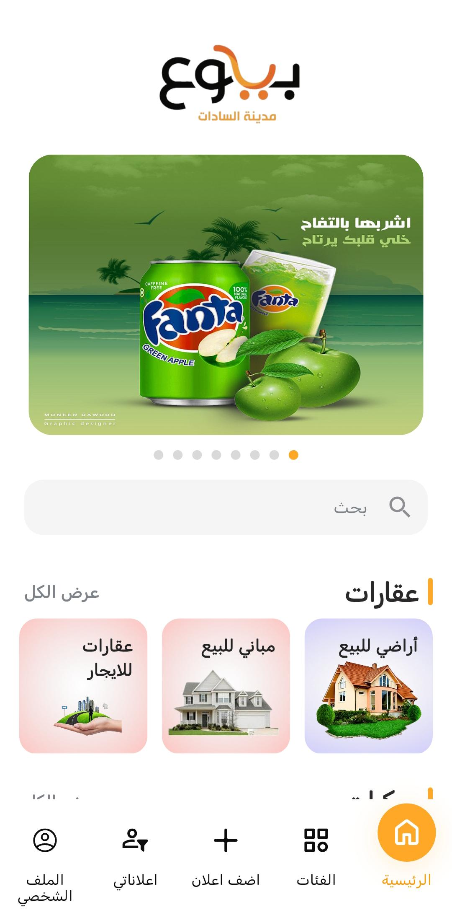
  &nbsp;&nbsp;&nbsp;&nbsp;
  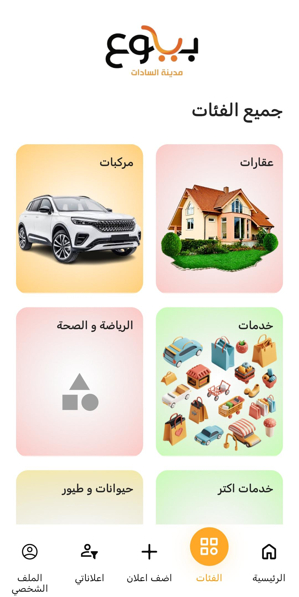
  &nbsp;&nbsp;&nbsp;&nbsp;
  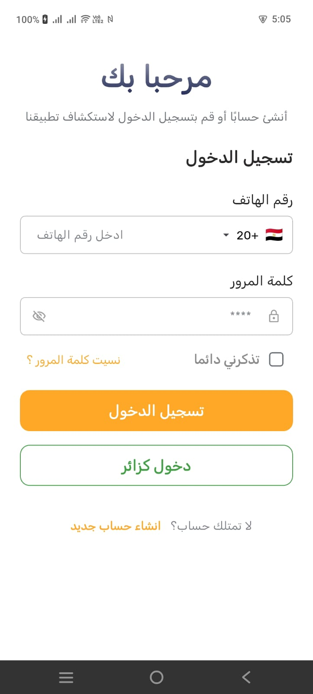
</p>

<h1 align="center">🏷️ BeYou3 — بيوع</h1>
<h3 align="center">Your Local Marketplace for Sadat City | سوقك المحلي في مدينة السادات</h3>

<p align="center">
  
  
  
  
</p>

---

## 📝 General Overview
**BeYou3 (بيوع)** is a comprehensive local classifieds and marketplace application tailored for **Sadat City (مدينة السادات)**, Egypt. The app empowers residents to buy, sell, and discover listings across a wide range of categories — from real estate and vehicles to services, animals, health, and more. With a sleek Arabic-first interface, powerful search capabilities, and real-time notifications, BeYou3 transforms the local trading experience into a modern, intuitive, and trustworthy digital marketplace. 🚀

---

## 🏗 System Architecture & Tech Stack

### 🏛 Architectural Principles:
The app follows a blend of **Clean Architecture** and **MVVM** (Model-View-ViewModel) with feature-first modularization to ensure a robust, testable, and maintainable codebase:
*   **Separation of Concerns:** Strict division between Data (Services, Models, Repositories), Domain (Interfaces), and Presentation (Cubits, UI).
*   **Repository Pattern:** Decoupling business logic from data sources using interfaces and implementations.
*   **Dependency Injection:** Centralized DI using **GetIt** for service locator pattern.
*   **Reactive State:** Leveraging **Cubit (Bloc)** for lightweight and reactive state handling. ⚡

### 🛠 Technical Core:
* **Networking:** **REST APIs** using [Dio](https://pub.dev/packages/dio) with caching interceptors for optimized performance. 🌐
* **Real-time Services:** **Firebase Cloud Messaging (FCM)** for instant push notifications. 🔔
* **Crash Reporting:** **Firebase Crashlytics** for production error tracking. 🛡️
* **Analytics:** **Firebase Analytics** for user behavior insights. 📊
* **Geolocation:** **Google Maps API** with Geolocator & Geocoding for precise location services. 📍
* **Localization:** [Easy Localization](https://pub.dev/packages/easy_localization) supporting Arabic & English. 🌍
* **OTA Updates:** **Shorebird** for seamless over-the-air code push updates. 🐦

---

The codebase is organized using a standardized, lowercase `snake_case` feature-first architecture:

```
lib/
├── features/                        # Feature-based domain modules
│   ├── auth/                        # Authentication (Login, Register, OTP, Password Reset)
│   │   ├── data/                    # Data sources, Models, and Repositories
│   │   ├── domain/                  # Repository interfaces & entities
│   │   └── presentation/           # Cubits and UI screens
│   ├── home/                        # Main dashboard with banner carousel & categories
│   ├── categories/                  # Category browsing & sub-categories
│   ├── ads/                         # Ads listing, search & filtering
│   ├── create_ad/                   # Multi-step ad creation wizard
│   ├── edit_ad/                     # Ad editing functionality
│   ├── banners/                     # Promotional banner management
│   ├── notifications/               # Push & local notification center
│   ├── profile/                     # User profile & account management
│   ├── main/                        # Main navigation shell (Bottom Nav)
│   └── splash/                      # App initialization & routing flow
│
├── core/                            # Core application layer (Shared)
│   ├── api/                         # Networking logic, Dio client & interceptors
│   ├── config/                      # App routes, DI, and asset constants
│   ├── error/                       # Error handling & failure models
│   ├── helpers/                     # Utility helpers (SharedPrefs, Logger, etc.)
│   ├── services/                    # Background services (FCM, Notifications)
│   ├── theme/                       # Unified theming, colors & typography
│   └── widgets/                     # Shared reusable UI components
│
├── firebase_options.dart            # Firebase configuration
└── main.dart                        # App entry point
```

✅ **Clear separation of concerns** — Config, services, and widgets are distinct  
✅ **Easy navigation** — Find files based on their purpose  
✅ **Better scalability** — Easy to add new features  
✅ **Maintainability** — Logical grouping makes code easier to understand  
✅ **Industry standards** — Follows Flutter/Dart best practices

---

### 1️⃣ Splash & Entry Flow 💨
The entry flow is optimized for a fast and responsive user experience, managed by **AuthStatusCubit** to handle initialization states.
* **Branded Splash:** A clean splash screen featuring the BeYou3 logo for instant brand recognition.
* **State-Driven Entry:** The app checks for valid authentication tokens during splash to automatically route returning users.
* **Firebase Init:** Firebase services (Crashlytics, FCM, Analytics) are initialized during app startup.

<p align="center">
  
</p>

---

### 2️⃣ Authentication & User Onboarding 🔐
A complete authentication module with secure login, registration, OTP verification, and password recovery.
* **Secure Login:** Phone number + password authentication with "Remember Me" and guest browsing support.
* **Smart Registration:** Full name, phone, and password with real-time validation (8+ chars, symbols, uppercase).
* **OTP Verification:** 6-digit PIN code entry with resend timer and countdown UI.
* **Password Recovery:** Complete forgot password flow — phone entry → OTP → new password → success confirmation.

| 🔑 Login | 📝 Register | 🔢 OTP | 🔄 Reset | ✅ Success |
|:---:|:---:|:---:|:---:|:---:|
| 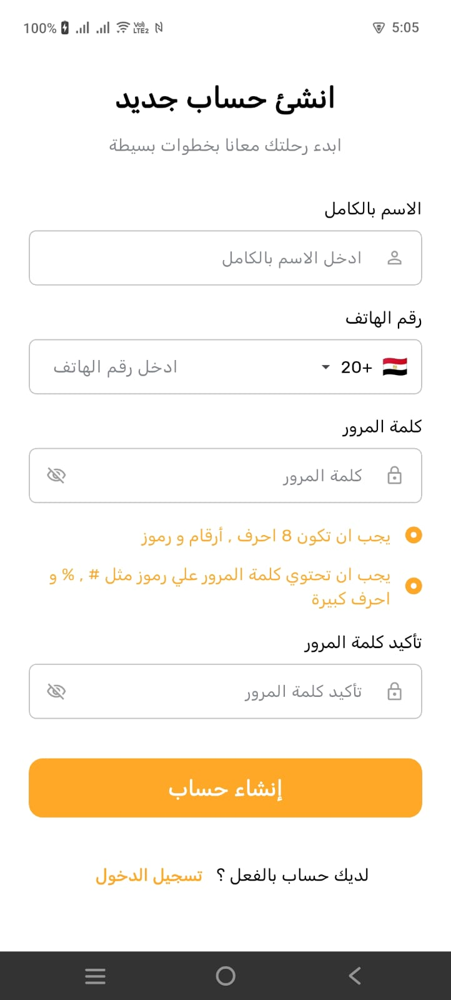 |  | 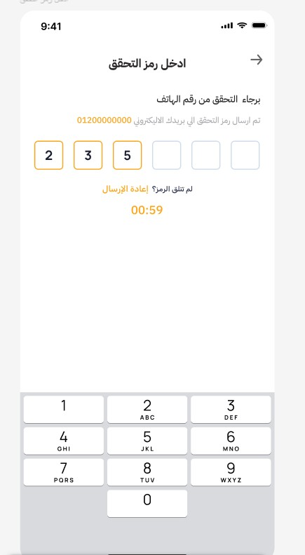 | 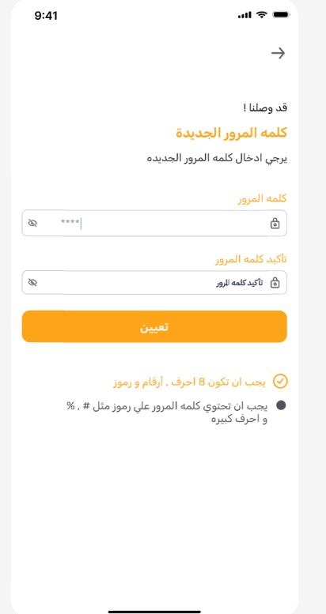 | 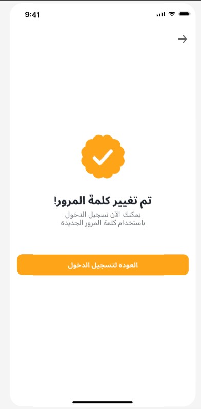 |

---

### 3️⃣ Home Screen & Discovery 🏠
The central hub where users explore the marketplace through promotional banners, search, and categorized listings.
* **Banner Carousel:** Auto-scrolling promotional banners from local businesses and advertisers.
* **Smart Search:** Quick search bar for finding ads across all categories instantly.
* **Category Sections:** Horizontally scrollable category cards (Real Estate, Vehicles, Services, Health, Animals, etc.) with "View All" navigation.
* **Bottom Navigation:** 5-tab layout — Home, Categories, Add Ad (+), My Ads, Profile.

| 🏠 Home (Top) | 🏠 Home (Sections) |
|:---:|:---:|
|  | 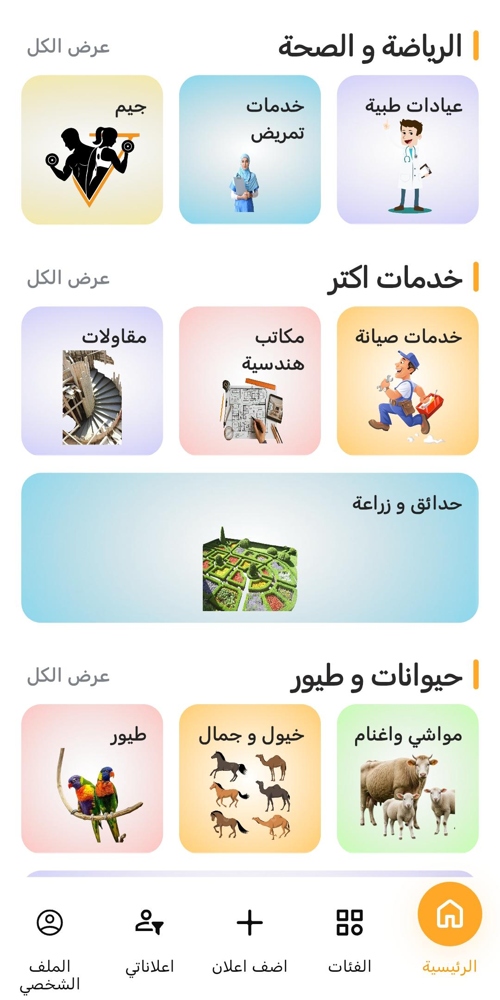 |

---

### 4️⃣ Categories & Sub-Categories 📂
A rich, multi-level category system with visually appealing cards for intuitive browsing.
* **Main Categories:** Real Estate (عقارات), Vehicles (مركبات), Services (خدمات), More Services (خدمات اكتر), Health & Sports (الرياضة و الصحة), Animals & Birds (حيوانات و طيور).
* **Deep Sub-Categories:** Each main category expands into detailed sub-categories (e.g., Vehicles → Cars, Motorcycles, Trucks, Spare Parts, Bicycles, Car Rentals).
* **Visual Cards:** Each sub-category features a unique illustration with soft gradient backgrounds.

| 📋 All Categories | 🏘 Real Estate | 🚗 Vehicles | 🛠 Services |
|:---:|:---:|:---:|:---:|
|  | 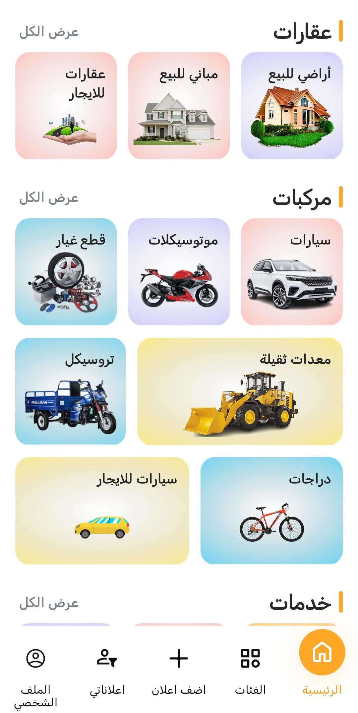 | 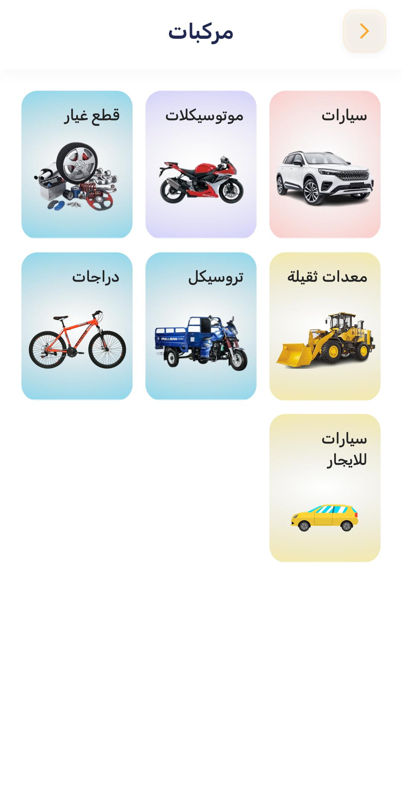 | 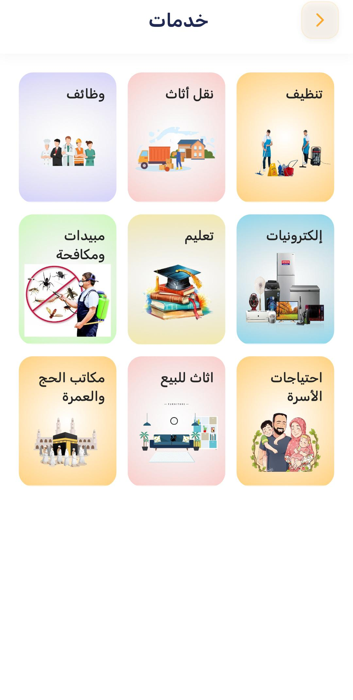 |

---

### 5️⃣ Ad Creation & Management 📝
A guided, multi-step ad creation wizard makes posting ads simple and intuitive.
* **Step-by-Step Wizard:** Progress bar with 3 stages — Basic Info → Details → Media Upload.
* **Category Selection:** Dropdown for selecting the main category.
* **Rich Editor:** Title, detailed description, and additional fields specific to each category.
* **My Ads Dashboard:** Tabs for Under Review (قيد المراجعة), Accepted (مقبول), and Rejected (مرفوض) ads.

| ➕ Create Ad | 📋 My Ads | 🔍 Empty State |
|:---:|:---:|:---:|
| 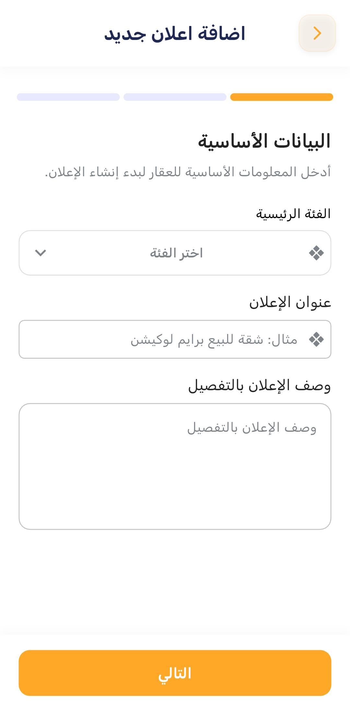 | 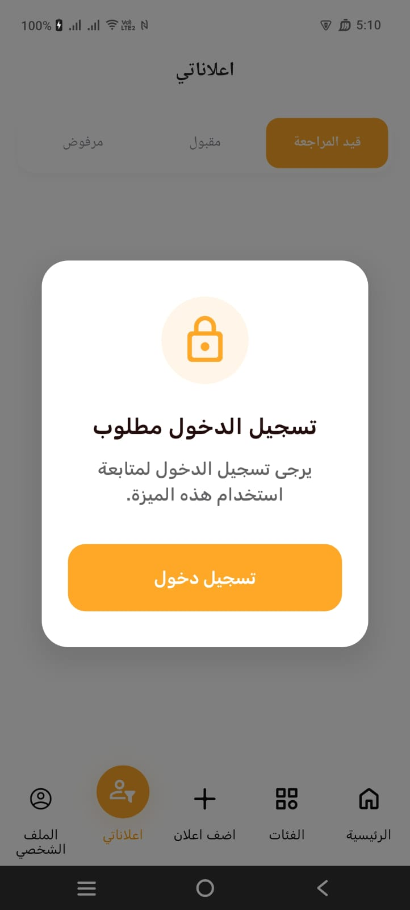 | 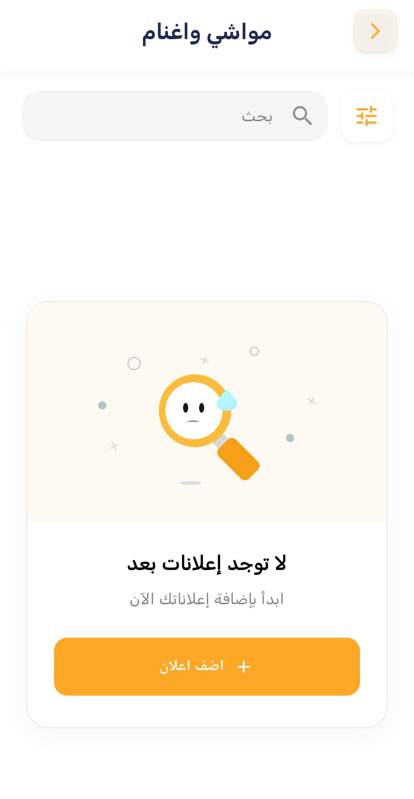 |

---

### 6️⃣ Additional Features ⚙️
* **Push Notifications:** Real-time alerts for ad status updates and platform announcements via FCM.
* **Offline Caching:** Dio cache interceptor with Hive store for smooth offline browsing.
* **Image Handling:** Image picker for ad photos with cached network images for fast loading.
* **URL Launcher:** Direct phone call and WhatsApp integration for contacting sellers.
* **Share:** Share ads externally using `share_plus`.
* **Shimmer Loading:** Beautiful skeleton loading states for a premium feel.
* **Pull to Refresh:** Custom refresh indicator for content updates.
* **Network Awareness:** Internet connection checker for graceful offline handling.

---

## 🔑 Key Features
- ✅ **Multi-language support** — Arabic & English with easy_localization
- ✅ **Firebase integration** — FCM, Crashlytics, and Analytics
- ✅ **Push & Local notifications** — Keep users informed in real-time
- ✅ **Responsive design** — flutter_screenutil for all screen sizes
- ✅ **Clean architecture** — MVVM with feature-first modularization
- ✅ **Google Maps integration** — Location-based services
- ✅ **Secure authentication** — Token-based auth with OTP verification
- ✅ **Offline caching** — Dio + Hive for seamless offline experience
- ✅ **OTA updates** — Shorebird for instant code push deployments
- ✅ **Ad management** — Full CRUD with review workflow
- ✅ **Guest mode** — Browse without registration
- ✅ **Shimmer loading** — Premium loading skeletons
- ✅ **Share & Contact** — WhatsApp, Call, and Share integration

---

## 📦 Dependencies
Key packages used:
- `flutter_screenutil` — Responsive UI across devices
- `easy_localization` — Internationalization (AR/EN)
- `firebase_core`, `firebase_messaging`, `firebase_crashlytics`, `firebase_analytics` — Firebase suite
- `flutter_local_notifications` — Local notification system
- `dio` & `dio_cache_interceptor` — Networking with caching
- `bloc` & `flutter_bloc` — State management
- `go_router` — Declarative routing
- `get_it` — Dependency injection
- `shared_preferences` & `flutter_secure_storage` — Local & secure storage
- `google_maps_flutter`, `geolocator`, `geocoding` — Maps & location
- `cached_network_image` — Efficient image loading
- `carousel_slider` — Banner carousel
- `image_picker` — Camera & gallery access
- `url_launcher` — External links, calls & WhatsApp
- `share_plus` — Content sharing
- `shimmer` — Loading skeletons
- `lottie` — Beautiful animations
- `pinput` — OTP input field
- `google_fonts` — Custom typography
- `flutter_svg` — SVG asset support
- `intl_phone_field` — International phone input

---

## 🛠 Installation & Setup
```bash
# 1. Clone the repository
git clone https://github.com/Abdoakram512/Beyou3.git

# 2. Install dependencies
flutter pub get

# 3. Run the app
flutter run

# 4. Build for release
flutter build apk --release
```

---

### Naming Conventions:
- **Classes**: PascalCase (e.g., `AppTheme`, `AuthStatusCubit`)
- **Files**: snake_case (e.g., `app_router.dart`, `shared_pref_helper.dart`)
- **Constants**: camelCase (e.g., `primaryColor`, `loginScreen`)
- **Routes**: Named routes via GoRouter (e.g., `'/login'`, `'/home'`)

### Adding New Features:
1. Create a new directory under `lib/features/` with `data/`, `domain/`, and `presentation/` subdirectories
2. Add reusable widgets to `core/widgets/`
3. Register dependencies in `core/config/dependency_injection/`
4. Define routes in `core/config/routers/app_router.dart`
5. Add asset paths to `core/config/assets/`
6. Follow existing MVVM + Clean Architecture pattern
7. Use Cubit for state management

---

<p align="center">
  Made with ❤️ for Sadat City | صُنع بحب لمدينة السادات
</p>
